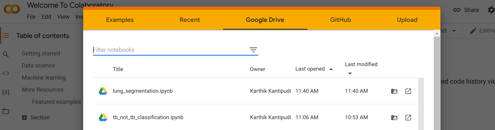

Deep Learning Tutorials for classification and segmentation in Medical Imaging
------------------------------------------------------------------------------

This repository contains jupyter notebooks useful for model development for classification and segmentation

## Setup folders and google colaboratory:

Download this repository and upload the unzipped folder('niehs_tutorials') under 'My Drive' in Google Drive. After you upload the
folder under you drive, click on this [link](https://colab.research.google.com/drive/) and go to Google Drive tab (). In there after you signin with your account, you should be able to see
the two notebooks.

## tb_not_tb_classification.ipynb:
This notebook serves as an example for binary classification  where we try to explore Chest X Rays(CXRs) and
develop prediction model to detect Tuberculosis or not.

In this notebook, we visualize the data, preprocess the CXRs (to contain **only the region of lungs** and remove  significant portions of the abdomen, neck, and head from standard CXRs), split the dataset to train/validation/test sets, develop a model using pretrained 'imagenet' weights and we will test them on their own test data to check the performance results.
We also check the robustness of the model  by testing the model on completely unseen variable data.

Description and setup about datasets used for this notebook are given in this notebook in a cell containing the heading as **Download the datasets (User can follow either of the options ).**

## lung_segmentation.ipynb:
This notebook serves as an example for  developing a deep learning segmentation model where we try to explore Chest X Rays(CXRs) and
develop segmentation model to segment lungs in the Chest X Rays.

In this notebook, we visualize the data, preprocess the CXRs (we combine right and left lung masks for a sample dataset, perform adaptive histogram equalization  ), split the dataset to train/validation/test sets, develop a model using basic UNet architecture and we will test them on their own test data to check the performance results.
We also check the robustness of the model  by testing the model on completely unseen variable data.

We use the Montgomery County dataset that is downloaded as part of step for previous notebook, for training the lung segmentation model.